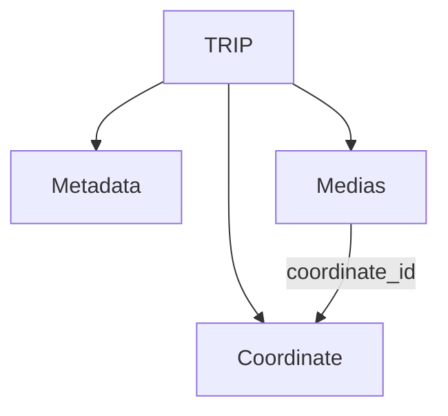

# TRIPPING Sync Architecture

## Data Model

---

## Sync Rules

| State | Action |
|---|---|
| **Hash = null** — fresh install or database wiped | Pull full media metadata from server |
| **Hash match** — in sync | No sync needed, return local data |
| **Hash different** — mismatch | Pull media metadata from server and perform sync |

---

## When to Sync

- **App refresh** — sync on every app open
- **Trip content modified on user end** — media uploads, delete media

---

## Notes

### Ghost Delete
When a media is deleted:
- The metadata is **not** actually deleted from the database
- Instead, an `is_deleted` flag is set to `true`
- The media **file itself** is actually deleted

This also happens on the server side.

> Ghost delete is easier to deal with in terms of sync, while the file itself gets deleted.git 